---
title: "User's Guide"
subtitle: "Reliability Calculation Tool and Excel User Interface"
author: "Big Ladder Software"
date: "January 25, 2021"
documentclass: scrartcl
number-sections: true
figureTitle: "Figure"
tableTitle: "Table"
figPrefix: "Figure"
tblPrefix: "Table"
secPrefix: "Section"
...
# Introduction

The purpose of this User's Guide is to give a working introduction to the command-line version of the resilience calculation tool (*ERIN*[^1]) and a user interface for the tool written in Microsoft Excel.

The purpose of the tool itself is to simulate the energy flows through a district energy system composed of an interacting network of components.
The main contributions of this tool that we maintain are unique in aggregate are as follows:

- the tool accounts for both reliability (failure and repair) as well as resilience to various scenarios (design basis threats)
- while also accounting for topology and interaction between an open-ended number of energy networks
- while providing key energy usage, resilience, and reliability metrics for the modeler / planner

The resilience calculation tool is available as open-source software written in C++.

Several command-line programs are included with the *ERIN* distribution including 3 key executables along with a library written in the *C++* programming language.
Documentation of the library itself is beyond the scope of this document.
However, the 3 executables will be given attention in this User's Guide as they are of particular interest to modelers.

The minimal user interface written in Microsoft Excel uses the command-line simulation tool behind the scenes as well as a *Modelkit/Params*[^2] template to make it easier to use.
We will cover usage of the Microsoft Excel interface in addition to the command-line programs.

[^1]: ERIN stands for Energy Resilience of Interacting Networks

[^2]: *Modelkit/Params* is a separate open-source project [available](https://bigladdersoftware.com/projects/modelkit/) from Big Ladder Software.

# Simulation Overview

In this section, we describe the simulation process to assess the resilience of a district system network to various scenarios including Design Basis Threats.

District Energy Systems play a major role in enabling resilient communities.
However, resilience is contextual.
That is, one must specify what one is resilient to.
This is specified in the tool using various “scenarios” which represent normal operation and various Design Basis Threats.
Design Basis Threats are low-probability, high-impact events such as hurricanes, flooding, earthquakes, terrorist attacks, tornadoes, ice storms, viral pandemics, etc.
Taking into account relevant Design Basis Threats is necessary for enabling resilient public communities.

The tool operates over networks that supply energy to both individual buildings and districts.
These networks are comprised of components (loads, generation, distribution/routing, storage, and transmission assets) and connections.
These connections form the topology of the network -- what is connected to what.
Multiple flows of energy can be modeled: notably, both thermal (heating/cooling) and electrical flows and their interactions.

This network of components is subject to various scenarios which represent one or more ideal cases (i.e., “blue-sky”) as well as Design Basis Threats (also known as “black-sky” events).
Each scenario has a probability of occurrence and zero or more “damage intensities” associated with it such as wind speed, vibration, water inundation level, etc.
Fragility curves are used to relate the scenario's damage intensities with the percentage chance that a given component will fail to work under the duress of the scenario.

Additionally, reliability statistics can be associated with components to model their routine failure and repair times and to take reliability into account in conjunction with various threats.
Note, however, that routine reliability statistics are most likely not applicable to an extreme event such as those represented from a design basis threat.
Fragility curves are more appropriate for that kind of assessment.

By looking at the performance of the network while taking into account the possibility of failure due to both typical reliability and failure due to threats, resilience metrics such as maximum downtime, energy availability, and load-not-served can be calculated.
This can, in turn, help planners to see whether a proposed system or change to an existing system will meet their threat-based resilience goals.

The workflow for using the tool is as follows:

- using a piece of paper, sketch out the network of locations and components and how they are connected
- using either the Excel user interface or a text editor, build an input file that describes:
  - the network of components
    - component physical characteristics
    - component failure modes
    - component fragility
    - how components are connected to each other
  - the scenarios to evaluate
    - the duration of the scenario
    - the occurrence distribution
    - damage intensities involved
  - load profiles associated with each load for each scenario
- simulate the given network over the given scenarios and examine the results

The simulation is specified using a discrete event simulator.
Events include:

- changes in a load
- changes in an uncontrollable source such as PV power generation
- routine failure of a working component under reliability
- routine repair of a failed component
- events due to physical limitations of devices (e.g., depleting the energy in a battery or diesel fuel tank)
- the initiation or ending of a scenario
- application of fragility curves at a scenario start

For every event that occurs, the simulation resolves and negotiates the conservation of energy throughout the network.
This results in resolving the flows through all connections in the network after each event.
Loads in particular are tracked to identify energy not served, time that a load's request is not fully supplied, and also to calculate the energy availability (energy served x 100% / energy requested).
These statistics are calculated *by load* and *by scenario*.

# Concept Overview

This section gives a quick overview of the key concepts used in the tool.
Understanding the concepts will help when authoring an input file as well as in interpreting the output results.

## Flows

A flow is any movement of a type of energy.
Examples include "electricity", "heated water for district heating", and "chilled water for cooling".
The flows specified are open-ended and not prescribed by the tool.
However, to aid new users, the Excel User Interface does limit the available flows to those typically used in an assessment.

By being imaginative, flows that are traditionally not considered as "energy flows" can be modeled as well.
For example, a supply of potable water pumped to a building can be modeled by phrasing it in terms of enthalpy times mass flow rate: $h \times \dot{m}$ (making assumptions for line pressures and temperatures).
This allows the contribution of a pump (changing the pressure and thus the flow work across the pump) to easily be taken into account.

A flow has a direction associated with it.
A flow can be zero (i.e., nothing is flowing) but cannot be negative.
Negative flows would imply a change in direction which would greatly increase the complexity of the simulation tool.
As such, we do not allow negative flows.
However, it is possible to simulate bi-directional flow by connecting components from both directions (more on this later).

## Components and Ports

A component is meant to represent any of a myriad of equipment used in a district energy system.
A component has zero or more inflow ports and zero or more outflow ports.
These ports take in zero or more flows, route and/or transform them, and output zero or more flows.
A component must have at least one port: inflow or outflow.

The fidelity of modeling is that of a 1-line diagram and accounts for energy flows only.
A component need only be taken into account if:

- it's function will significantly affect network flows
- and it's failure is statistically significant in the face of either reliability or fragility to a threat

For example, a relatively efficient stretch of pipe in a district heating system can be ignored from an energy standpoint if it's losses are insignificant compared to other equipment.
However, if that stretch of pipe is deemed to have a statistically significant possibility of failure during a threat event such as an earthquake, it should be modeled.
In this instance, a pass-through component (see below) with a fragility curve (see below) may be a good choice.

## Component Types

Because we model components at a high-level of abstraction, a few component types are all that's needed to model many real-world components.
In this section, we discuss the available component types and their characteristics.

### Component Type: Load

A load is essentially an exit point out of the network for "useful work".
A load typically represents an end use such as a building or cluster of building's electricity consumption or heating load consumption.

A load specifies its load versus time with a load profile which is specified per scenario.

### Component Type: Source

A source is an entry point into the simulation for providing energy flow into the network.
A source typically represents useful energy into the system such as electrical energy from the utility, natural gas into the district, or diesel fuel transported to a holding tank.

### Component Type: Uncontrolled Source

Normally, a source responds to a request up to its available max output power (which defaults to being unlimited).
In contrast, an uncontrolled source cannot be commanded to a given outflow because the source is uncontrollable.
Typical examples of uncontrolled sources are electricity generated from a photovoltaic array, heat generated from concentrating solar troughs, or electricity from a wind farm.
Another typical uncontrolled source is heat to be removed from a building as a "cooling load".

An uncontrolled source specifies its supply values versus time with a supply profile which is specified per scenario.
Note: functionally, a supply profile and load profile are the same thing.

### Component Type: Converter

A converter represents any component that takes in one kind of flow and converts it to another type of flow, usually with some loss.
Converters have an efficiency associated with them.
The current version of the tool only supports a constant-efficiency.
Typical examples of converter components are boilers, electric generators (e.g., fired by diesel fuel or natural gas), transformers, and line-losses.

The loss flow from one component can be chained into another converter component to simulate various loss-heat recovery mechanisms and equipment such as combined heat and power (CHP) equipment.

### Component Type: Storage

A storage component represents the ability to store flow.
The storage unit has both a charge (inflow) port and a discharge (outflow) port.
The storage component cannot accept more flow than it has capacity to store.
Similarly, a storage component cannot discharge more flow than it has stored.
Typical examples of a storage component include battery systems, pumped hydro, diesel fuel storage tanks, coal piles, and thermal energy storage tanks.

The current version of the storage tank does not have an efficiency or leakage component associated with it.
However, charge/discharge efficiency can be approximated with converter components and leakage via a small draw load.

### Component Type: Pass-Through

A pass-through component is a component that physically exists on the system but that only passes flow through itself without disruption.
As such, it is does not change the energy flow of the network.
Therefore, the main use for a pass-through component is in providing equipment to associate failure modes and fragility curves (discussed below) with.
Since failure of the component results in a loss of a flow, it may be important to take into account.
Typical examples of pass-through components are above-ground and below-ground power lines, natural-gas pipe runs, district heating pipe runs, etc.

### Component Type: Muxer

A "muxer" or multiplexer component represents various components for splitting and joining flows.
Typical examples include manifolds, routers, electrical bus bars, and the like.

Muxers can have multiple inflow ports and multiple outflow ports.
Muxer's contain dispatch strategies to choose how requests are routed.
There are two dispatch strategies available in the current tool:

- in-order dispatch: all flow is requested to be satisfied from the first inflow port first.
  If that flow is insufficient, the second inflow port is requested for the remainder until all inflow ports are exhausted.
  For cases where outflow request is not met, the first outflow port is satisfied first.
  If flow remains, that flow is routed to the next port until it is satisfied or the flow is spent, and so on to the next port, etc.
- distribute dispatch: all flow is distributed between all ports.
  In this strategy, requests are distributed evenly between inflow ports.
  When flow is insufficient to meet all outflow request, available flow is distributed evenly to outflow ports.

These strategies are not sophisticated enough to cover advanced energy saving strategies.
However, they should be sufficient to mimic basic dispatch strategies for assessing load supply.

### Component Type: Mover

Note: the mover component is currently only available from the command-line interface.
It has not yet been made available for the Excel User Interface.

A mover component is a component that moves energy from its inflow port to its outflow port with the assistance of a support flow.
Movers can be used to represent chillers and heat pumps (which move heat) as well as pumps and fans (which move fluids).

## Networks and Connections

Component connections via ports form a network.
Networks describe the interaction of various flows.

A connection describes:

- a source component and its outflow port
- a sink (i.e., receiving) component and its inflow port
- and the type of flow being delivered

## Scenarios

Scenarios represent both typical usage (i.e., blue sky events) and design basis threat events (class 4 hurricanes, earthquakes, land-slides, etc.).

A scenario has:

- a duration (how long the scenario will last)
- an occurrence distribution which is a cumulative distribution function that expresses the likelihood of occurrence
- a maximum number of times the scenario can occur during the entire simulation (either *unlimited* or some finite number)
- and various damage intensities associated with the scenario

The damage intensities associated with a scenario are open-ended but are meant to represent numerical quantities that correspond with a fragility curve.
Some examples of damage intensities that could be associated with a scenario are "wind speed", "inundation depth", "vibration", etc.
Scenarios with no damage intensities are completely fine -- these would represent "blue-sky" scenarios (typical operation).

## Reliability: Failure Modes and Statistical Distributions

Reliability is handled strictly as a statistical matter using failure modes.
A failure mode is an association between a failure distribution and the corresponding repair distribution.
Multiple failure modes can be specified for a single component.
For example, a diesel back-up generator may have one failure mode associated with its starter battery and another to represent more serious issues with the generator itself.

Every failure mode in the simulation is turned into an "availability schedule".
That is, for each failure mode, the dual distributions are alternatively sampled from time 0 to the end of the overall simulation time to derive a schedule of "available" and "failed".
When a scenario where reliability is calculated is scheduled to occur, the relevant portion of the availability schedules for components with failure modes are used to "schedule" the component as available and failed to simulate routine reliability events during that scenario's simulation.

## Resilience: Intensities (Damage Metrics) and Fragility Curves

Resilience reflects how components react to the intense stresses of a design basis threat event.
Each scenario can specify an intensity or damage metric.
Any component having a fragility curve that responds to one or more of the scenario intensities is evaluated for failure due to the scenario's intensity.

For example, above-ground power lines may have a fragility to wind speed.
If a scenario specifies a wind speed of 150 mph, the above-ground power line component will use its fragility curve to look up its chance of failure.
For fragility, a component is evaluated for failure at scenario start and either passes (staying up during the scenario) or fails (going down until repaired).
Repairs for fragility failures are specified by declariing explicit "fragility modes" which associate a fragility curve with a repair distribution.

# Input File Format {#sec:input-file-format}

The simulation engine is a command-line program.
Even when it is accessed via the Excel User Interface, a text-based input file is written to describe the network of components and scenarios to simulate.

The input file format is written using the TOML[^3] input file language.
TOML is a plain-text input file format.

[^3]: TOML is described in detail here: https://toml.io/en/

The file consists of the following sections that describe the various concepts described above:

- `simulation_info`: general simulation information
- `loads`: load profiles (includes supply profiles for uncontrolled sources)
- `components`: all components in the network are described here
- `fragility_mode`: all fragility curves and (optional) repair distributions are described here
- `dist`: statistical distributions
- `failure_mode`: failure modes are described here
- `networks`: networks are described here
- `scenarios`: scenarios are described here

Valid entries for each of the sections are described in [@tbl:sim-info; @tbl:loads; @tbl:comps-common; @tbl:source; @tbl:load; @tbl:converter; @tbl:pass-through; @tbl:uncontrolled-src; @tbl:mover; @tbl:frags; @tbl:dist; @tbl:fm; @tbl:nw; @tbl:scenarios].

The types given are one of:

* str: a string of characters in "quotes"
* bool: true or false
* real: a real number (0.0, 1.5, 2e7, etc.)
* real>0: a real number greater than 0.0. $0.0 <$ real>0
* int: an integer
* int>0: an integer > 0
* $[X]$: an array of the given type, $X$
* $\left[\left[X\right]\right]$: an array of arrays of $X$
* time: time unit. One of {"years", "days", "hours", "minutes", "seconds"}
* cap: capacity unit. One of {"kJ", "kWh"}
* disp: dispatch strategy. One of {"distribute", "in_order"}.
* frac: real fraction. $0.0 \le$ frac $\le 1.0$
* frac>0: real fraction greater than 0.0. $0.0 <$ frac $\le 1.0$
* rate: the rate unit. Currently, only "kW" is accepted.
* $X \rightarrow Y$: designates a map data structure (a.k.a., dictionary, hash table, table, etc.).
  Associates $Y$ with $X$.

In the TOML input file, all constructs except `simulation_info` have an id.
The id is used when one construct references another.

This looks as follows:

```toml
[loads.load_profile_id_1]
...
[loads.load_profile_id_2]
...
[components.component_id_1]
...
[components.component_id_2]
...
[fragility_mode.fragility_mode_id_1]
...
[dist.statistical_distribution_id_1]
...
[failure_mode.failure_mode_id_1]
...
[networks.network_id_1]
...
[scenarios.scenario_id_1]
...
```

An id must follow the rules of TOML "bare keys"[^bare-keys] with the exception that dashes (`-`) are not allowed and the key must start with an ASCII letter:

> Bare keys may only contain ASCII letters, ASCII digits, underscores, ... .

[^bare-keys]: see https://toml.io/en/v1.0.0-rc.1#keys

| key                   | type   | required? | notes                                   |
| ----                  | --     | --        | --------                                |
| `time_unit`           | time   | no        | The time unit. Default "years"          |
| `fixed_random`        | frac   | no        | Sets the random roll to a fixed value   |
| `fixed_random_series` | [real] | no        | Sets random numbers to the given series |
| `random_seed`         | real   | no        | Sets the random number generator's seed |
| `max_time`            | int    | no        | Maximum simulation time. Default: 1000  |

: `simulation_info` specification {#tbl:sim-info}

Note: [@tbl:sim-info] specifies various random values. At most, one of these values can be specified.

| key               | type         | required? | notes                           |
| ----              | --           | --        | --------                        |
| `csv_file`        | str          | no        | path to CSV file with profile   |
| `time_rate_pairs` | \[\[real\]\] | no        | array of (time, rate) pairs     |
| `time_unit`       | time         | no        | time unit for `time_rate_pairs` |
| `rate_unit`       | rate         | no        | rate unit for `time_rate_pairs` |

: `loads` specification {#tbl:loads}

For [@tbl:loads], one must specify either a `csv_file` *or* `time_rate_pairs`, `time_unit`, and `rate_unit`.
Unfortunately, only "kW" is available for `rate_unit` at the moment although `time_unit` accepts "years", "seconds", or "hours".
Practically speaking, you will almost always use a `csv_file` unless you just want to test a simple load.

For the `csv_file`, the header must be "hours,kW" with data filled into the rows below.
The "hours" column is the elapsed time in hours.
The "kW" column is the flow in kW.
The first column header can be set to values beside "hours"; any time unit is valid.
However, the rate unit is currently locked in as "kW".

| key               | type    | required? | notes                            |
| ----              | --      | --        | --------                         |
| `failure_modes`   | \[str\] | no        | failure mode ids for component   |
| `fragility_modes` | \[str\] | no        | fragility mode ids for component |

: `components`: common attributes {#tbl:comps-common}

[@tbl:comps-common] lists the attributes common to all components.
These relate to reliability and resilience: failure modes and fragility curves.

| key           | type | required? | notes                     |
| ----          | --   | --        | --------                  |
| `type`        | str  | yes       | must be "source"          |
| `outflow`     | str  | yes       | type of outflow           |
| `max_outflow` | real | no        | maximum allowable outflow |

: `components`: Source Component {#tbl:source}

| key                 | type                  | required? | notes                         |
| ----                | --                    | --        | --------                      |
| `type`              | str                   | yes       | must be "load"                |
| `inflow`            | str                   | yes       | type of outflow               |
| `loads_by_scenario` | str $\rightarrow$ str | yes       | map of scenario id to load id |

: `components`: Load Component {#tbl:load}

In [@tbl:load], the `loads_by_scenario` structure is specified as follows:

```toml
loads_by_scenario.scenario_id_1 = "load_id_1"
loads_by_scenario.scenario_id_2 = "load_id_2"
```

| key                   | type   | required? | notes                             |
| ----                  | --     | --        | --------                          |
| `type`                | str    | yes       | must be "converter"               |
| `inflow`              | str    | yes       | type of inflow                    |
| `outflow`             | str    | yes       | type of outflow                   |
| `lossflow`            | str    | no        | type of lossflow. Default: inflow |
| `constant_efficiency` | frac>0 | yes       | constant efficiency               |

: `components`: Converter Component {#tbl:converter}

| key             | type | required? | notes                                  |
| ----            | --   | --        | --------                               |
| `type`          | str  | yes       | must be "store"                        |
| `flow`          | str  | yes       | type of flow (inflow, outflow, stored) |
| `capacity_unit` | cap  | no        | capacity unit. Default: "kJ"           |
| `capacity`      | real | yes       | capacity of the store                  |
| `max_inflow`    | real | yes       | maximum inflow (charge rate)           |

: `components`: Storage Component {#tbl:store}

During simulation, the `max_inflow` sets the requested charging rate for a storage unit (see [@tbl:store]).
By default, a storage unit will always request to charge itself to its maximum capacity.
However, it will always honor its discharge request above its charge request.
That is, if discharge is requested, it will discharge rather than charge.
If charging and discharging at the same time, charge flow will "short circuit" to meet the discharge request first.
Any flow left over will charge the store.

| key                 | type | required? | notes                                    |
| ----                | --   | --        | --------                                 |
| `type`              | str  | yes       | must be "muxer"                          |
| `flow`              | str  | yes       | type of flow (inflow, outflow)           |
| `num_inflows`       | int  | yes       | the number of inflow ports               |
| `num_outflows`      | int  | yes       | the number of outflow ports              |
| `dispatch_strategy` | disp | no        | dispatch strategy. Default: "`in_order`" |

: `components`: Muxer Component {#tbl:muxer}

In [@tbl:muxer], the `dispatch_strategy` refers to the strategy at the outflow of the muxer.
The inflow strategy is always "`in_order`".
That is, the first connected port gets the full request.
If that inflow port can't meet the full flow, we request the remaining flow from the second inflow port, etc.
The outflow strategy is set in the model input file using the `dispatch_strategy` key as shown in [@tbl:muxer].

The `dispatch_strategy` for a muxer only manifests when there is a flow deficiency.
That is, normally, all requests at each outflow port are achieved.
However, when there is not enough flow, "`in_order`" dispatch feeds the first outflow port first and then turns its attention to the second and so on until flow runs out.
For a "`distribute`" `dispatch_strategy`, when flow is lacking, the available flow is distributed evenly.

Let's consider an example.
A muxer with 4 outflow ports gets the following request: [50, 50, 50, 50] (= 200 kW).
However, only 100 kW is available to supply these outflow requests.
An "`in_order`" dispatch will provide [50, 50, 0, 0] (= 100 kW) to its four outflow ports.
In contrast, a "`distribute`" `dispatch_strategy` will provide [25, 25, 25, 25] (= 100 kW) to each outflow port.
Consider a non-uniform request of say [50, 10, 90, 50] (= 200 kW) on the same mux; again, however, only 100 kW is available.
An "`in_order`" dispatch would provide [50, 10, 40, 0] (= 100 kW).
In contrast, a "`distribute`" dispatch strategy would provide [30, 10, 30, 30] (= 100 kW) to each outflow port.

| key           | type   | required? | notes                          |
| ----          | --     | --        | --------                       |
| `type`        | str    | yes       | must be "pass_through"         |
| `flow`        | str    | yes       | type of flow (inflow, outflow) |
| `max_outflow` | real>0 | no        | defaults to infinite flow      |

: `components`: Pass-Through Component {#tbl:pass-through}

| key                  | type                  | required? | notes                          |
| ----                 | --                    | --        | --------                       |
| `type`               | str                   | yes       | must be "uncontrolled_source"  |
| `outflow`            | str                   | yes       | type of outflow                |
| `supply_by_scenario` | str $\rightarrow$ str | yes       | scenario id to load profile id |

: `components`: Uncontrolled Source Component {#tbl:uncontrolled-src}

Similar to the load component, the uncontrolled source's `supply_by_scenario` specifies supply profiles by scenario.
These look like the following:

```toml
supply_by_scenario.scenario_id_1 = "load_id_1"
supply_by_scenario.scenario_id_2 = "load_id_2"
```

Note that the uncontrolled source supply profiles are also drawn from the same section of the input file specified as `loads`.

| key       | type   | required? | notes                                               |
| ----      | --     | --        | --------                                            |
| `type`    | str    | yes       | must be "mover"                                     |
| `inflow0` | str    | yes       | the inflow being "moved"                            |
| `inflow1` | str    | yes       | the "support" inflow that enables "moving" to occur |
| `outflow` | str    | yes       | the outflow                                         |
| `cop`     | real>0 | yes       | the coefficient of performance                      |

: `components`: Mover Component {#tbl:mover}

In [@tbl:mover], the `cop` field ties together the three flows `inflow0`, `inflow1`, and `outflow` using the following relations:

$$cop = \frac{inflow_0}{inflow_1}$$

$$inflow_0 = cop \times inflow_1$$

$$inflow_1 = inflow_0 \times \frac{1}{cop}$$

$$outflow = (1 + cop) \times inflow_1 = (1 + \frac{1}{cop}) \times inflow_0 = inflow_0 + inflow_1$$


| key             | type | required? | notes                                                      |
| ----            | --   | --        | --------                                                   |
| `vulnerable_to` | str  | yes       | the scenario intensity (i.e., damage metric) vulnerable to |
| `type`          | str  | yes       | currently, only "linear" is available                      |
| `lower_bound`   | real | yes       | the value below which we are impervious to damage          |
| `upper_bound`   | real | yes       | the value above which we face certain destruction          |

: `fragility_curve` specification {#tbl:frags}

Fragility curves are specified using the attributes listed in [@tbl:frags].
[@fig:fragility-curve] shows a graphical representation of the data specification.

{#fig:fragility-curve}

A fragility curve maps a scenario's intensity (i.e., damage metric) to a probability of failure.
We must specify which damage metric is of interest and also the curve relationship.
Currently, the only available fragility curve type is linear.
For the linear curve, we specify the `lower_bound`, the bound below which we are impervious to destruction.
We also specify the `upper_bound`, the bound above which we face certain destruction.

In order to be able to associate a given failure mode due to a fragility with a repair curve, we specify a `fragility_mode`.
A `fragility_mode` associates a `fragility_curve` id with a repair `dist` id.
Multiple `fragility_modes` can be specified for a given component.
Each fragility mode represents a fragility-induced failure due to a scenario's damage intensity and optional repair distribution.
The attributes of a `fragility_mode` declaration are given in [@tbl:fragility-mode].


| key               | type | required? | notes                                                                       |
| ----              | --   | --        | --------                                                                    |
| `fragility_curve` | str  | yes       | id of a fragility curve                                                     |
| `repair_dist`     | str  | no        | id of a repair distribution; if not specified, not repaired during scenario |

: `fragility_mode` specification {#tbl:fragility-mode}


| key         | type | required? | notes                                                            |
| ----        | --   | --        | --------                                                         |
| `type`      | str  | yes       | one of `fixed`, `uniform`, `normal`, `quantile_table`, `weibull` |
| `time_unit` | time | no        | the time unit used to specify the fixed value; defaults to hours |

: general `dist` specification {#tbl:dist}

[@tbl:dist] specifies parameters common to all types of distribution.
Depending on the value of `type`, the remaining parameters to a distribution can vary.
The parameters for the various distribution types are shown in [@tbl:fixed], [@tbl:uniform], [@tbl:normal], [@tbl:quantile], and [@tbl:weibull].

[@tbl:fixed] gives the parameters for a fixed distribution.
A fixed distribution is a degenerate distribution that always samples a single point -- the `value`.


| key         | type | required? | notes                               |
| ----        | --   | --        | --------                            |
| `value`     | real | yes       | the value of the fixed distribution |

: `dist` with `type=fixed` {#tbl:fixed}


[@tbl:uniform] gives the parameters for a uniform distribution.
A uniform distribution is a distribution with equal frequency for any point between the `lower_bound` and `upper_bound`.


| key           | type | required? | notes                                       |
| ----          | --   | --        | --------                                    |
| `lower_bound` | real | yes       | the lower bound of the uniform distribution |
| `upper_bound` | real | yes       | the upper bound of the uniform distribution |

: `dist` with `type=uniform` {#tbl:uniform}

[@tbl:normal] gives the parameters for a normal distribution.
A normal distribution is a distribution with a `mean` and a `standard_deviation`.


| key                  | type | required? | notes                                             |
| ----                 | --   | --        | --------                                          |
| `mean`               | real | yes       | the mean of the normal distribution               |
| `standard_deviation` | real | yes       | the standard deviation of the normal distribution |

: `dist` with `type=normal` {#tbl:normal}

[@tbl:quantile] allows a user to specify the quantile of their own custom distribution.
The "quantile" is also sometimes called the "percent point funciton" and "inverse cumulative distribution function".
A great way to get the quantile is to tabulate the cumulative distribution function of time from 0 (no failures) to 1 (all failed) and switch the columns.


| key                  | type         | required? | notes                                                                 |
| ----                 | --           | --        | --------                                                              |
| `csv_file`           | str          | no        | name of CSV file with columns headers of `ANY,<time_unit>`            |
| `variate_time_pairs` | \[\[real\]\] | no        | an array of two-tuples of variate [0.0, 1.0] to time (in `time_unit`) |

: `dist` with `type=quantile_table` {#tbl:quantile}

[@tbl:weibull] allows a user to specify a 3-parameter Weibull distribution.


| key        | type | required? | notes                                    |
| ----       | --   | --        | --------                                 |
| `shape`    | real | yes       | the "shape" parameter                    |
| `scale`    | real | yes       | the "scale" parameter in `time_units`    |
| `location` | real | no        | the "location" parameter in `time_units` |

: `dist` with `type=weibull` {#tbl:weibull}


| key            | type | required? | notes                       |
| ----           | --   | --        | --------                    |
| `failure_dist` | str  | yes       | the failure distribution id |
| `repair_dist`  | str  | yes       | the repair distribution id  |

: `failure_mode` specification {#tbl:fm}


| key           | type        | required? | notes           |
| ----          | --          | --        | --------        |
| `connections` | \[\[str\]\] | yes       | the connections |

: `networks` specification {#tbl:nw}

The `networks` data definition involves a "mini-language" to specify connections.
The language is as follows:

```toml
connections = [
  [ "src_comp_id:OUT(outflow_port)", "sink_comp_id:IN(inflow_port)", "flow"],
  ...
  ]
```

The `connections` key is an array of 3-tuples.
The first element of the 3-tuple is the source component id separated by a ":" and then the word "OUT(.)".
You will type the outflow port in place of the ".".
Note that numbering starts from 0.

The second element of the 3-tuple is the sink component id.
That is, the component that *receives* the flow.
The sink component id is written, then a ":", and finally the word "IN(.)".
You will type the inflow port id in place of the ".".
Numbering of inflow ports starts from 0.

The final element of the 3-tuple is the flow id.
You are requested to write the flow id as a check that ports are not being wired incorrectly.


| key                          | type                   | required? | notes                                                 |
| ----                         | --                     | --        | --------                                              |
| `time_unit`                  | time                   | no        | time units for scenario. Default: "hours"             |
| `occurrence_` `distribution` | str                    | yes       | the id of a distribution                              |
| `duration`                   | int>0                  | yes       | the duration of the scenario                          |
| `max_occurrences`            | int                    | yes       | the maximum number of occurrences. -1 means unlimited |
| `calculate_` `reliability`   | bool                   | no        | whether to calculate reliability. Default: false      |
| `network`                    | str                    | yes       | the id of the network to use                          |
| `intensity`                  | str $\rightarrow$ real | no        | specify intensity (damage metric) values              |

: `scenarios` specification {#tbl:scenarios}

The `occurrence_distribution` must point to the name of a distribution (distributions are given in [@tbl:dist]).

# Output Metrics

The metrics used to assess resilience are given an overview in this section.
[@fig:metrics] depicts the metrics graphically.
It is important to note that metrics are calculated *by load* and *per scenario*.

{#fig:metrics}

As seen in [@fig:metrics], there are three basic calculations:

- energy availability
- load not served
- and max downtime

[@fig:metrics] shows four areas of flow integration over time: $A$, $B$, $C$, and $D$.
The sum of $A$, $B$, and $D$ is the energy delivered to this load for this scenario.
$C$ represents the load not served.
The ratio of $\frac{(A+B+D) \times 100 \%}{A+B+C+D}$ is the energy availability.
The duration of load interruption (from $t_0$ to $t_1$) is the max downtime.

The energy availability is calculated as follows:

$$EA = \frac{E_{achieved} \times 100 \%}{E_{requested}}$$

In the above equation, the energy, $E$, is the integral of the flow, $f$, over time:

$$E = \int_{t=0}^{t_{end}}{f \cdot dt}$$

Max downtime is the duration of load interruption:

$$T_{\textrm{down}} = \int{dt}\; \textrm{where} \; f_{\textrm{achived}} < f_{\textrm{requested}}$$

Load not served is then:

$$E_{\textrm{not served}} = \int_{t=0}^{t_{end}}{(f_{\textrm{requested}} - f_{\textrm{achieved}}) \cdot dt}$$

# Command-Line Tool

Three command-line programs are available for simulation and assistance.
They will be given an overview here.

## `erin`

Simulates a single scenario and generates results.

**USAGE**:

`erin` `<input_file_path>` `<output_file_path>` `<stats_file_path>` `<scenario_id>`

- `input_file_path`: path to TOML input file
- `output_file_path`: path to CSV output file for time-series data
- `stats_file_path`: path to CSV output file for statistics
- `scenario_id`: the id of the scenario to run

The output from the call to `erin` will be written into two files: an output file and a statistics file.

The output file has the column headers shown in [@tbl:erin-out].

| Column            | Description                                                           |
| --                | --------                                                              |
| time (hours)      | the elapsed time since scenario start in hours                        |
| \*:achieved (kW)  | the achieved flow at the event time for each component/port recorded  |
| \*:requested (kW) | the requested flow at the event time for each component/port recorded |

: `erin` Output {#tbl:erin-out}

The statistics file has the column headers shown in [@tbl:erin-stats].

| Column               | Description                                                            |
| --                   | --------                                                               |
| component id         | the id of the component                                                |
| type                 | the type of the component (e.g., load, source, etc.)                   |
| stream               | the stream flowing through the given component / port                  |
| energy availability  | the energy availability for the given component                        |
| max downtime (hours) | the maximum number of contiguous hours when load not fully met         |
| load not served (kJ) | the load not served in kJ                                              |
| $X$ energy used (kJ) | for each flow, report out the energy used in kJ                        |
| TOTAL ($X$)          | the total energy used by flow by component type                        |
| ENERGY BALANCE       | a sum of the energy balance. Should be small compared to source inflow |

: `erin` Statistics {#tbl:erin-stats}

## `erin_multi`

Simulates all scenarios in the input file over the simulation time and generates results.

**USAGE**:

`erin_multi` `<input_file_path>` `<output_file_path>` `<stats_file_path>`

- `input_file_path`: path to TOML input file
- `output_file_path`: path to CSV output file for time-series data
- `stats_file_path`: path to CSV output file for statistics

The output files from `erin_multi` are very similar to those shown in [@tbl:erin-out; @tbl:erin-stats].
The main difference is that `erin_multi` aggregates across multiple scenario instances and multiple scenario types.
The column headers used in the event output file for `erin_multi` are shown in [@tbl:erin-multi-out].

| Column              | Description                                                           |
| --                  | --------                                                              |
| scenario id         | the id of the scenario simulated                                      |
| sceanrio start time | start time of scenario in ISO 8601 duration format                    |
| elapsed (hours)     | the elapsed time since scenario start in hours                        |
| \*:achieved (kW)    | the achieved flow at the event time for each component/port recorded  |
| \*:requested (kW)   | the requested flow at the event time for each component/port recorded |

: `erin_multi` Output {#tbl:erin-multi-out}

The statistics file for `erin_multi` has the column headers as shown in [@tbl:erin-multi-stats].

| Column               | Description                                                            |
| --                   | --------                                                               |
| scenario id | scenario id for the scenario reported out                                       |
| number of occurrences | number of times the scenario occurred during simulation               |
| total time in scenario (hours) | total time spent in the scenario during simulation           |
| component id         | the id of the component                                                |
| type                 | the type of the component (e.g., load, source, etc.)                   |
| stream               | the stream flowing through the given component / port                  |
| energy availability  | the energy availability for the given component                        |
| max downtime (hours) | the maximum number of contiguous hours when load not fully met         |
| load not served (kJ) | the load not served in kJ                                              |
| $X$ energy used (kJ) | for each flow, report out the energy used in kJ                        |
| TOTAL ($X$)          | the total energy used by flow by component type                        |
| ENERGY BALANCE       | a sum of the energy balance. Should be small compared to source inflow |

: `erin_multi` Statistics {#tbl:erin-multi-stats}

## `erin_graph`

Generates an input file for use with [Graphviz](https://graphviz.gitlab.io/).
Graphviz is an external dependency.
You do not need Graphviz to generate the Graphviz input file.
However, you *do* need Graphviz to process that input file into a `.png` or `.pdf` file.

**USAGE**:

`erin_graph` `<input_file_path>` `<dot_file_path>` `<network_id>`

- `input_file_path`: path to TOML input file
- `dot_file_path`: path to Graphviz DOT file to write
- `network_id`: id for the network to plot from input_file_path

Upon successful execution, you can render your Graphviz dot file into a PNG (image file) as follows:

- `dot -Tpng input.gv -o output.png`
  The above generates a png (`-Tpng`) from the `input.gv` and saves to `output.png` (`-o`)

Similarly, you can render your Graphviz dot file into a PDF as follows:

- `dot -Tpdf input.gv -o output.pdf`
  The above generates a png (`-Tpdf`) from the `input.gv` and saves to `output.pdf` (`-o`)

`erin_graph` is capable of creating sophisticated topological graphs such as the one in [@fig:topology-example].

{#fig:topology-example width=75%}

## Other Programs

There are a few other test programs that come with the *ERIN* distribution.
One we will metion is `erin_distribution_test`.
This is a convenient program used to exercise the statistical distributions that ship with *ERIN*.

**USAGE**

`erin_distribution_test` `<distribution_name>` `<param_1>` `<param_2>` `<param_3>` `<param_4>`

- `distribution_name`: one of 'fixed', 'uniform', 'normal', 'weibull', 'table'
- `param_1`
    - fixed: the fixed value
    - uniform: the lower bound
    - normal: the mean of the distribution
    - weibull: the shape parameter of the Weibull distribution
    - table: name of a CSV file with the quantile (i.e., inverse
      cumulative distribution function) defined in two columns:
      variate and dtime (no header)
- `param_2`
    - fixed: the number of samples
    - uniform: the upper bound
    - normal: the standard deviation of the distribution
    - weibull: the scale parameter of the Weibull distribution
    - table: the number of samples
- `param_3`
    - fixed: unused, don't write anything (i.e., leave blank)
    - uniform: the number of samples
    - normal: the number of samples
    - weibull: the location parameter of the Weibull distribution
    - table: unused, don't write anything (i.e., leave blank)
- `param_4`
    - fixed: unused, don't write anything (i.e., leave blank)
    - uniform: unused, don't write anything (i.e., leave blank)
    - normal: unused, don't write anything (i.e., leave blank)
    - weibull: the number of samples
    - table: unused, don't write anything (i.e., leave blank)

An example of using the program to sample a normal distribution with mean of 31,536,000 (1 year in seconds) and standard deviation of 3,600,000 (1000 hours) is as follows:

    > erin_distribution_test normal 31536000 3600000 10000 > data.csv

This creates a CSV datafile in the current directory with 10,000 sample points from the normal distribution.
That file can then be plotted using Microsoft Excel or the Python script in the scripts directory:

    > python scripts/plot_distribution_data.py data.csv hours

This produces, for example, the plot shown in [@fig:erin-dist-test].

{#fig:erin-dist-test width=75%}


# Microsoft Excel User Interface

A simple interface using Microsoft Excel has been created to ease the creation of an input data file for `erin`.
This interface runs the simulation on behalf of the user and also pulls the input
Due to limitations in Excel's Visual Basic, the current version of the Microsoft Excel user interface is limited to the Windows Operating System.

## Software Dependency: Modelkit/Params Framework

*Modelkit/Params* is required to allow the Microsoft Excel user interface to render an input file template for `erin_multi`.
*Modelkit/Params* is a third party dependency available as open-source software from Big Ladder Software:

[https://bigladdersoftware.com/projects/modelkit/](https://bigladdersoftware.com/projects/modelkit/)

Please install *Modelkit Catalyst*.
Version 0.5 or later is required.

Further detail about *Modelkit* can be found at the above link.

## Additional Concept: Location

To make it easier for modelers to specify a network of components, the Excel user interface introduces an additional concept called a "location".
A location is open-ended although the names and ids must follow the same rules for ids as in the input file (see [@sec:input-file-format]).

At a given location, any number of components can be specified.
The Excel User Interface uses Big Ladder's *Modelkit/Params* to render an input file from a template.
That template assumes a given topology for each location as shown in [@fig:location-topology].

{#fig:location-topology}

As depicted in [@fig:location-topology], for any given flow type, the following sets of components are in series:

- all loads: load components, internal loads, and outbound links
- all storage for the given flow type (multiples are in parallel)
- all mover components: multiples are in parallel
- all converters and sources: converters (including CHP which is modeled as chained converters), internal sources, uncontrolled sources, inbound links, and normal source components

## Additional Concept: Network Link

The location topology template shown in [@fig:location-topology] alludes to inbound and outbound links.
The links themselves are called "network links".
They are similar to normal connections except that they connect locations.

We believe the template in [@fig:location-topology] to be typical of how components at a location are typically connected, topologically speaking.
However, if further variation is needed, it can often be achieved by creating multiple locations and linking them together.
For example, if one wanted to model two storage units in *series* (vs *parallel*), they need only create a storage in location $A$ and another in location $B$ and denote that location $B$ has a network link from $B$ to $A$.

## Interface Overview

The Excel user interface to `erin_multi` is laid out logically to help new users specify a component network to simulate.

The major screens are:

- Instructions (see [@fig:excel-instructions])
- Settings (see [@fig:excel-settings])
- Components (see [@fig:excel-components])
- Network (see [@fig:excel-network])
- Scenarios (see [@fig:excel-scenarios])

The "Instructions" sheet gives light instructions on how to use the workbook.
The "Settings" tab is where the path to `erin_multi.exe` is set.
A modeler can also add additional statistical distributions, failure modes, and fragility curves here.
The "Components" tab is where a modeler can add different types of components to a location.
The "Network" tab is where network links between locations can be specified.
The "Scenarios" tab is where different Scenarios can be added and configured.

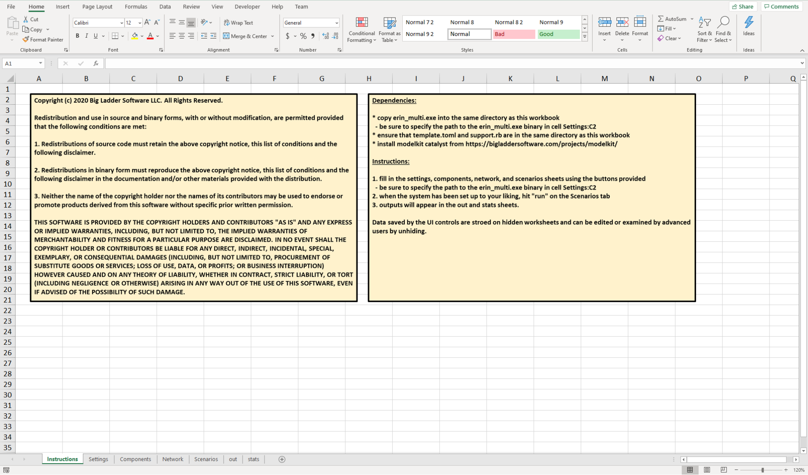{#fig:excel-instructions width=50%}

{#fig:excel-settings width=50%}

{#fig:excel-components width=50%}

{#fig:excel-network width=50%}

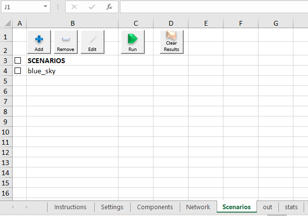{#fig:excel-scenarios width=50%}

# Example Problem

In this final section, we will specify a simple problem using both the input file and the Excel User Interface.
The problem will involve a single building with an electrical load, an electric generator on-site, and a utility supply of natural gas.
We will simulate two scenarios: a blue-sky scenario and a class 4 hurricane scenario.

An iconic sketch of the network we will build appears in [@fig:example-network].

{#fig:example-network}

The steps to create this network and simulate it are as follows:

## Text Input File

1. Open a new file `input.toml` for editing using your favorite text editor.
   Add the following simulation information:

```toml
[simulation_info]
rate_unit = "kW"
quantity_unit = "kJ"
time_unit = "years"
max_time = 100
```

2. Create a simple load profile by hand.
   Open the file `b1-load-profile.csv` in your favorite text editor.
   Type in the following and save:

```csv
hours,kW
0,100
8760,0
```

3. Back in `input.toml`, add the load profile information at the end of the file:

```toml
[loads.lp1]
csv_file = "b1-load-profile.csv"
```

4. Next, still within `input.toml`, let's add the components:

```toml
[components.utility_ng_source]
type = "source"
outflow = "natural_gas"

[components.b1_electricity]
type = "load"
inflow = "electricity"
loads_by_scenario.blue_sky = "lp1"
loads_by_scenario.c4_hurricane = "lp1"

[components.b1_electric_generator]
type = "converter"
inflow = "natural_gas"
outflow = "electricity"
lossflow = "waste_heat"
constant_efficiency = 0.42
fragility_modes = ["flooding", "wind"]
```

In the table above, we have added a natural gas source (`utility_ng_source`), an electrical load at building 1 (`b1_electricity`), and an electrical generator at building 1 (`b1_electric_generator`).
The electric generator has an efficiency of 42% and has two fragility modes: "`flooding`" and "`wind`".
Neither of the fragility modes have been specified yet, so we'll tackle them next.

5. Within `input.toml`, specify the fragility curves.

```toml
[fragility_curve.flooding_curve]
vulnerable_to = "inundation_depth_ft"
type = "linear"
lower_bound = 4.0
upper_bound = 8.0

[fragility_curve.wind_curve]
vulnerable_to = "wind_speed_mph"
type = "linear"
lower_bound = 150.0
upper_bound = 220.0

[fragility_mode.flooding]
fragility_curve = "flooding_curve"

[fragility_mode.wind]
fragility_curve = "wind_curve"
repair_dist = "repair_in_72_hours"
```

These fragility curves and fragility modes reflect how we will model the equipment's resilience versus the threat. 
For the flooding fragility mode, we don't expect to be able to repair within the scenario's duration.
Therefore, we do not specify a `repair_dist` entry.
However, for the `wind` fragility mode, we will specify a repair distribution of `repair_in_72_hours`.
This will be specified later in the file when we come to distributions (i.e., `dist` entries).

6. Specify the network connections.

```toml
[networks.nw]
connections = [
  ["utility_ng_source:OUT(0)", "b1_electric_generator:IN(0)", "natural_gas"],
  ["b1_electric_generator:OUT(0)", "b1_electricity:IN(0)", "electricity"],
  ]
```

7. Specify the different types of distributions.

```toml
[dist.always]
type = "fixed"
value = 0.0
[dist.every_30_years]
type = "fixed"
value = 30.0
time_unit = "years"
[dist.repair_in_72_hours]
type = "fixed"
value = 72.0
time_unit = "hours"
```

This specifies the types of distributions that will be used later in the tool.
We have specified three fixed distributions: one that occurrs continuously and one that occurs every 30 years.
The third is one that occurs every 72 hours and is used as the repair for wind-based fragility failures.


8. Specify the scenarios.

```toml
[scenarios.blue_sky]
time_unit = "hours"
occurrence_distribution = "always"
duration = 8760
max_occurrences = 1
calculate_reliability = true
network = "nw"
[scenarios.c4_hurricane]
time_unit = "days"
occurrence_distribution = "every_30_years"
duration = 14
max_occurrences = -1
calculate_reliability = true
network = "nw"
intensity.wind_speed_mph = 155.0
intensity.inundation_depth_ft = 6.0
```

The finished file should look like the following:

```toml
[simulation_info]
rate_unit = "kW"
quantity_unit = "kJ"
time_unit = "years"
max_time = 100

[loads.lp1]
csv_file = "b1-load-profile.csv"

[components.utility_ng_source]
type = "source"
outflow = "natural_gas"

[components.b1_electricity]
type = "load"
inflow = "electricity"
loads_by_scenario.blue_sky = "lp1"
loads_by_scenario.c4_hurricane = "lp1"

[components.b1_electric_generator]
type = "converter"
inflow = "natural_gas"
outflow = "electricity"
lossflow = "waste_heat"
constant_efficiency = 0.42
fragility_modes = ["flooding", "wind"]

[fragility_curve.flooding_curve]
vulnerable_to = "inundation_depth_ft"
type = "linear"
lower_bound = 4.0
upper_bound = 8.0

[fragility_curve.wind_curve]
vulnerable_to = "wind_speed_mph"
type = "linear"
lower_bound = 150.0
upper_bound = 220.0

[fragility_mode.flooding]
fragility_curve = "flooding_curve"

[fragility_mode.wind]
fragility_curve = "wind_curve"
repair_dist = "repair_in_72_hours"

[networks.nw]
connections = [
  ["utility_ng_source:OUT(0)", "b1_electric_generator:IN(0)", "natural_gas"],
  ["b1_electric_generator:OUT(0)", "b1_electricity:IN(0)", "electricity"],
  ]

[dist.always]
type = "fixed"
value = 0.0

[dist.every_30_years]
type = "fixed"
value = 30.0
time_unit = "years"

[dist.repair_in_72_hours]
type = "fixed"
value = 72.0
time_unit = "hours"

[scenarios.blue_sky]
time_unit = "hours"
occurrence_distribution = "always"
duration = 8760
max_occurrences = 1
network = "nw"

[scenarios.c4_hurricane]
time_unit = "days"
occurrence_distribution = "every_30_years"
duration = 14
max_occurrences = -1
network = "nw"
intensity.wind_speed_mph = 155.0
intensity.inundation_depth_ft = 6.0
```

The file can be called as `erin_multi.exe input.toml out.csv stats.csv`.
This assumes that `erin_multi.exe` is on your path.

## Excel User Interface

Using the Excel Interface, we will create the same problem specified in [@fig:example-network].

TODO: update this section to describe how to handle fragility-modes (i.e., fragility curve with repair).

1. Open the workbook and ensure the path to `erin_multi.exe` is set.
   See [@fig:excel-settings].
   Also, ensure you have the following files in one directory as shown in [@fig:required-files]:

- `erin_gui.xlsm`
- `erin_multi.exe`
- `support.rb`
- `template.toml`
- `example-load.csv`: not required in general but we'll use it for this example

{#fig:required-files width=50%}

An easy way to get the path to `erin_multi.exe` is to find it in the file system and, while holding the SHIFT key, right click on the file and select "Copy as Path" as shown in [@fig:copying-the-path].
The value so copied can be pasted into the cell with the path in the Settings sheet.
Be sure to save the workbook once you've set the path.

{#fig:copying-the-path width=50%}

2. We will start by adding two fragility curves.
   See [@fig:excel-step-a; @fig:excel-step-b].

We'll call the first fragility curve "wind" and set the "Vulnerable To" field to  "`wind_speed_mph`" with a range from 150 to 220 mph.
The second fragility curve we'll call "flooding" and set the "Vulnerable To" field to "`inundation_depth_ft`" with bounds of 4.0 to 8.0 feet.

{#fig:excel-step-a width=50%}

{#fig:excel-step-b width=50%}

3. Next we'll begin filling in the Components as shown in [@fig:excel-step-1; @fig:excel-step-2; @fig:excel-step-3; @fig:excel-step-4; @fig:excel-step-5; @fig:excel-step-6; @fig:excel-step-7; @fig:excel-step-c; @fig:excel-step-8].

{#fig:excel-step-1 width=50%}

{#fig:excel-step-2 width=50%}

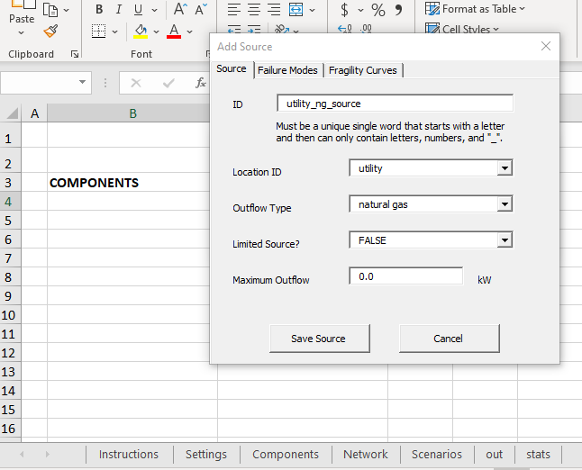{#fig:excel-step-3 width=50%}

{#fig:excel-step-4 width=50%}

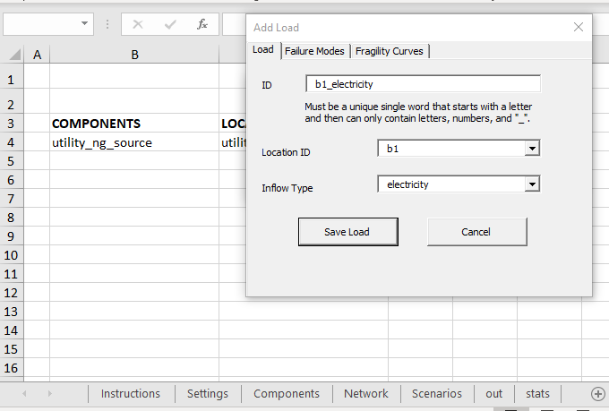{#fig:excel-step-5 width=50%}

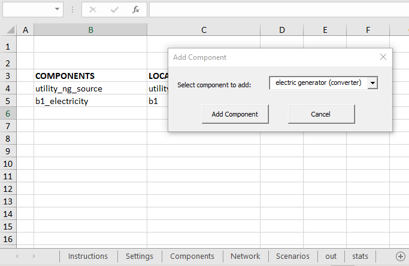{#fig:excel-step-6 width=50%}

{#fig:excel-step-7 width=50%}

{#fig:excel-step-c width=50%}

{#fig:excel-step-8 width=50%}

4. With all the components added, move on to the "Network" sheet.
   We must add a network link between the "utility" location and the "b1" (building #1) location as shown in [@fig:excel-step-9; @fig:excel-step-10].

{#fig:excel-step-9 width=50%}

{#fig:excel-step-10 width=50%}

5. Finally, add the scenarios and intensity values as shown in [@fig:excel-step-11; @fig:excel-step-12; @fig:excel-step-13; @fig:excel-step-14; @fig:excel-step-15; @fig:excel-step-16; @fig:excel-step-17; @fig:excel-step-18; @fig:excel-step-19].

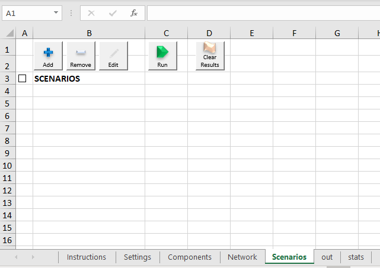{#fig:excel-step-11 width=50%}

{#fig:excel-step-12 width=50%}

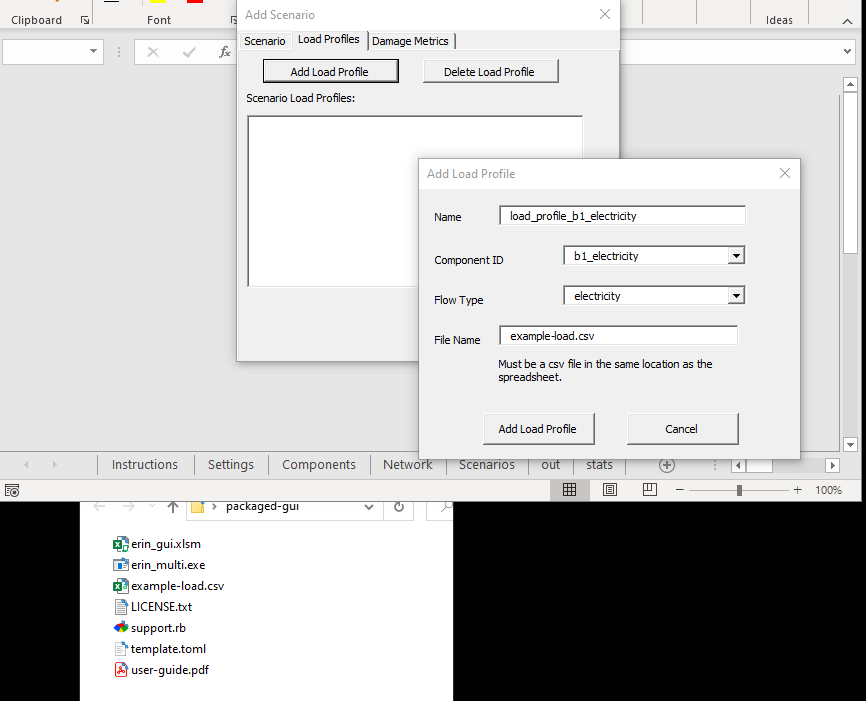{#fig:excel-step-13 width=50%}

{#fig:excel-step-14 width=50%}

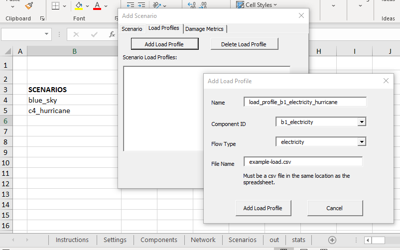{#fig:excel-step-15 width=50%}

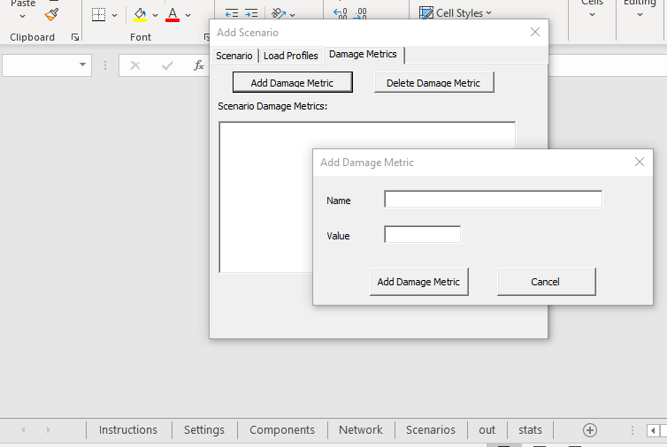{#fig:excel-step-16 width=50%}

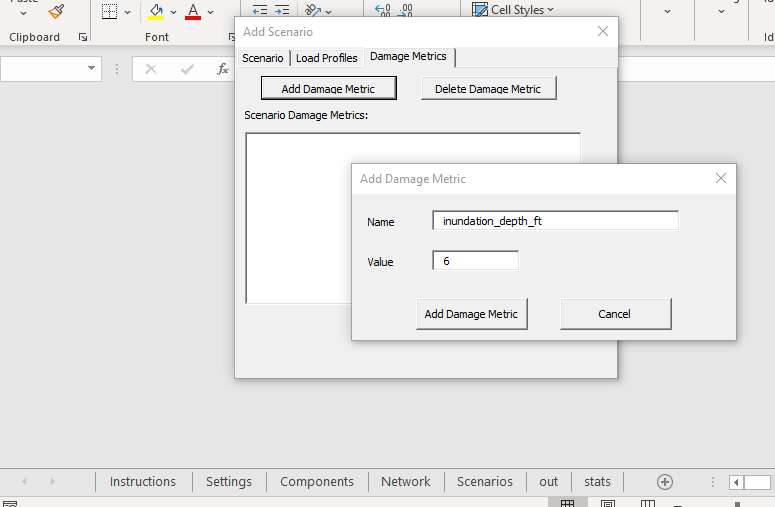{#fig:excel-step-17 width=50%}

{#fig:excel-step-18 width=50%}

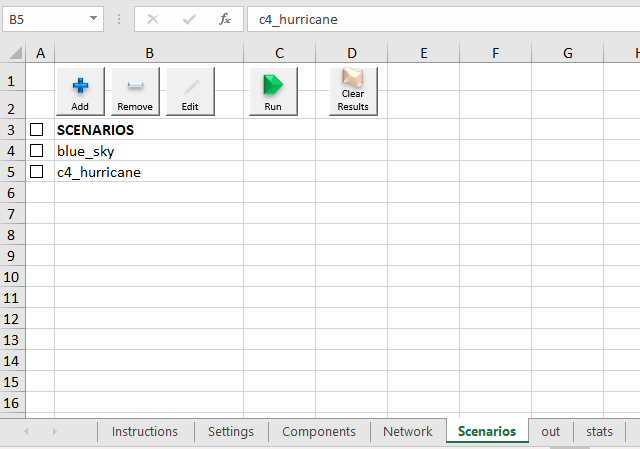{#fig:excel-step-19 width=50%}

6. Finally, hit the run button to simulate the network.

# When Things Don't Work: Checklist for MS Excel UI

The Microsoft Excel user interface to the *ERIN* engine is a convenient way to access the power of the engine without having to manually write an input file.
However, the decoupling between Excel and the *ERIN* engine adds just enough complexity to the picture that it can be difficult to determine what's wrong when things don't work as they should.
This section provides a series of checks to help you methodically identify the source of any potential problems and either correct it yourself or help us to quickly pinpoint the issue.
These instructions were written assuming you are using a recent version of Microsoft Windows as that is the only operating system supported by the MS Excel User Interface.

- **Are you using MS Windows?**
  Unfortunately, the link between Microsoft Excel and the *ERIN* engine is only supported on Microsoft Windows at this time.
  If you are not using Microsoft Windows, you can still use the simulation engine directly or through the *Modelkit* template generation capability.
- **Do you have Microsoft Excel installed?**
  This may be obvious, but ensure that you actually have Microsoft Excel installed.
  We are currently using Microsoft Excel for Office 365.
  Any recent version of Microsoft Excel should work, but if you do have to submit a bug report, please note the version of Microsoft Excel you are using.
  Unfortunately, other spreadsheet programs that can open and edit Microsoft Excel files such as Open Office or Libre Office do not work.
- **Have you installed *Modelkit Catalyst*?**
  *Modelkit Catalyst*, a free download available from Big Ladder Software, is a required pre-requisite for using the MS Excel User Interface.
  If you haven't already installed it, please download it from [https://bigladdersoftware.com/projects/modelkit/](https://bigladdersoftware.com/projects/modelkit/).
- **Is *Modelkit Catalyst* working correctly?**
  To determine if *Modelkit* is installed correctly, go to the Windows start menu and type `cmd`.
  This should bring up the option to launch the "Command Prompt".
  Launch the "Command Prompt" and type `modelkit`.
  You should see a help text return to you giving an overview of the *Modelkit* commandline interface options.
  If you do not see this, right-click on your start menu button and select "settings" from the menu.
  Type "Add or remove programs" in the search dialogue.
  If you do not see "Modelkit Catalyst" in the list of installed programs, you have not yet installed *Modelkit* so stop here and download and install *Modelkit Catalyst*.
  If you do see "Modelkit Catalyst", try uninstalling and reinstalling the program and try using the instructions again for the MS Excel UI example.
  If you are still having problems, please submit a bug report for support.
- **Is the *ERIN* simulation engine working correctly?**
  Next, we need to confirm that the *ERIN* simulation engine is working correctly.
  Unzipped a *fresh* folder from the original file zip archive to ensure there are no changes you made that are creating issues.
  You can do this by right clicking on the zip archive and selecting "Extract All...".
  Next, open "File Explorer".
  If you are unfamiliar with how to do this, click on the Start menu and type "File Explorer" and open the application called "File Explorer".
  In File Explorer, navigate to that extracted (i.e., unzipped) folder.
  This folder should contain the `iea-annex-73-tool.xlsm`, `erin_multi.exe`, and several other files including this User's Guide.
  In the address bar of File Explorer, type `CMD` to start a new command shell in that folder (or use any other method of opening a command shell at the folder of the unzipped contents).
  In the "Command Prompt" that is opened, type `erin_multi.exe`.
  You should see a usage message that also lists the version of the simulator.
  If you do not see this, please submit a bug report for support.
- **Did you enable macros when opening the Microsoft Excel workbook?**
  Visual Basic for Applications Macros are required when using the Microsoft Excel User Interface.
  When you opened the `xlsm` file, you should have been prompted with "SECURITY WARNING: Macros have been disabled."
  You will need to hit the button to "Enable Content" in order to use the interface.
- **Is the Microsoft Excel User Interface workbook in the same folder as `erin_multi.exe`, `support.rb`, and `template.toml`?**
  If you are working from a freshly extracted (i.e., unzipped) folder, all the required files should be in the same folder together.
  If you are not, please do start again from a freshly extracted folder to help us methodically debug the issue.
- **Have you added the complete path to *ERIN* simulation engine in cell C2 of the "Settings" sheet?**
  Even if you have already done this, it can't hurt to double check and cut and paste the path again.
  Again, we recommend that you use the *freshly* extracted Excel workbook at this point (versus one you've already been typing in).
  The best way to get the path to the `erin_multi.exe` simulation engine is to go to the freshly extracted folder using File Explorer, hold down the SHIFT key while right clicking on "`erin_multi.exe`", and select the option "Copy as path".
  Then, open the Microsoft Excel User Interface and paste (CTRL+V) the path into cell C2 of the "Settings" sheet.
  Note: even if you have spaces in your path, do not add quotes around your path.
  The tool automatically surrounds the path in "double quotes" and if you add your own double quotes in cell C2, that will actually cause an error.
  The path you paste in must be unquoted.
- **Lastly, have you followed the details of the example tutorial *exactly*?**
  There are known issues where you can formulate an incorrect problem using the Excel User Interface.
  Common issues include:
    - not having a proper load header: did you use the `example-load.csv` file as a reference?
    - specifying an immediately occurring scenario with no occurrence limit: an occurrence distribution of "ALWAYS" must be accompanied by a Max Occurrence of 1 or more.
    - is there a network link between sources and load locations?

If, after exhausting all of the above checks, you are still having issues, please do not hesitate to contact us for support.
